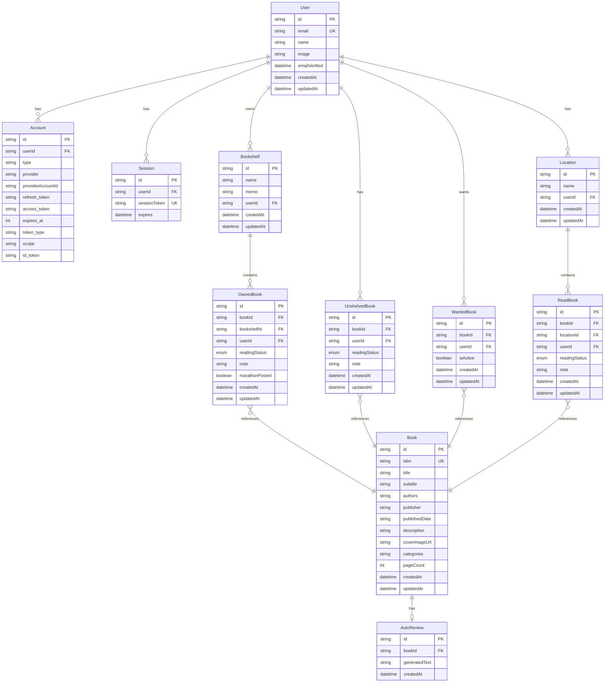

# 本の管理アプリケーション ER図

## ER図（Mermaid）

## リレーション一覧

| 親テーブル | 子テーブル | 関係 | 説明 |
|-----------|-----------|------|------|
| User | Account | 1:N | NextAuth OAuth連携 |
| User | Session | 1:N | NextAuth セッション |
| User | Bookshelf | 1:N | ユーザーは複数の本棚を持つ |
| User | UnshelvedBook | 1:N | ユーザーは複数の未確定本を持つ |
| User | WantedBook | 1:N | ユーザーは複数の欲しい本を持つ |
| User | Location | 1:N | ユーザーは複数の場所を持つ |
| Bookshelf | OwnedBook | 1:N | 本棚には複数の本がある |
| Location | ReadBook | 1:N | 場所には複数の読んだ本がある |
| Book | OwnedBook | 1:N | 1冊の本は複数ユーザーが所有可能 |
| Book | UnshelvedBook | 1:N | 1冊の本は複数ユーザーが所有可能 |
| Book | WantedBook | 1:N | 1冊の本は複数ユーザーが欲しい可能 |
| Book | ReadBook | 1:N | 1冊の本は複数ユーザーが読んだ可能 |
| Book | AutoReview | 1:1 | 1冊の本に1つのAI感想 |

## Enum定義

### ReadingStatus（読書状況）
| 値 | 説明 |
|----|------|
| NOT_READ | 読んでいない |
| READING | 読書中 |
| COMPLETED | 読了 |

## テーブル詳細

### User（ユーザー）
NextAuthで管理されるユーザー情報

| カラム | 型 | 制約 | 説明 |
|--------|-----|------|------|
| id | String | PK | CUID |
| email | String | UNIQUE | メールアドレス |
| name | String? | | 表示名 |
| image | String? | | プロフィール画像URL |
| emailVerified | DateTime? | | メール認証日時 |
| createdAt | DateTime | | 作成日時 |
| updatedAt | DateTime | | 更新日時 |

### Book（書籍マスタ）
Google Books APIから取得した書籍情報

| カラム | 型 | 制約 | 説明 |
|--------|-----|------|------|
| id | String | PK | CUID |
| isbn | String? | UNIQUE | ISBNコード |
| title | String | | タイトル |
| subtitle | String? | | サブタイトル |
| authors | String | | 著者（JSON配列） |
| publisher | String? | | 出版社 |
| publishedDate | String? | | 出版日 |
| description | String? | | 説明 |
| coverImageUrl | String? | | 表紙画像URL |
| categories | String? | | カテゴリ（JSON配列） |
| pageCount | Int? | | ページ数 |
| createdAt | DateTime | | 作成日時 |
| updatedAt | DateTime | | 更新日時 |

### Bookshelf（本棚）
ユーザーが作成する本棚

| カラム | 型 | 制約 | 説明 |
|--------|-----|------|------|
| id | String | PK | CUID |
| name | String | | 本棚名 |
| memo | String? | | メモ |
| userId | String | FK | ユーザーID |
| createdAt | DateTime | | 作成日時 |
| updatedAt | DateTime | | 更新日時 |

### OwnedBook（所有本）
本棚に配置済みの本

| カラム | 型 | 制約 | 説明 |
|--------|-----|------|------|
| id | String | PK | CUID |
| bookId | String | FK | 書籍ID |
| bookshelfId | String | FK | 本棚ID |
| userId | String | FK | ユーザーID |
| readingStatus | Enum | | 読書状況 |
| note | String? | | メモ |
| marathonPosted | Boolean | | 読書マラソン投稿済みフラグ |
| createdAt | DateTime | | 作成日時 |
| updatedAt | DateTime | | 更新日時 |

### UnshelvedBook（未確定の本）
購入済みだが本棚未配置の本

| カラム | 型 | 制約 | 説明 |
|--------|-----|------|------|
| id | String | PK | CUID |
| bookId | String | FK | 書籍ID |
| userId | String | FK | ユーザーID |
| readingStatus | Enum | | 読書状況 |
| note | String? | | メモ |
| createdAt | DateTime | | 作成日時 |
| updatedAt | DateTime | | 更新日時 |

### WantedBook（欲しい本）
ユーザーが欲しい本リスト

| カラム | 型 | 制約 | 説明 |
|--------|-----|------|------|
| id | String | PK | CUID |
| bookId | String | FK | 書籍ID |
| userId | String | FK | ユーザーID |
| isActive | Boolean | | アクティブフラグ（false=過去に欲しかった本） |
| createdAt | DateTime | | 作成日時 |
| updatedAt | DateTime | | 更新日時 |

### Location（場所）
家以外の場所（図書館など）

| カラム | 型 | 制約 | 説明 |
|--------|-----|------|------|
| id | String | PK | CUID |
| name | String | | 場所名 |
| userId | String | FK | ユーザーID |
| createdAt | DateTime | | 作成日時 |
| updatedAt | DateTime | | 更新日時 |

### ReadBook（読んだ本）
家にはないが読んだ本

| カラム | 型 | 制約 | 説明 |
|--------|-----|------|------|
| id | String | PK | CUID |
| bookId | String | FK | 書籍ID |
| locationId | String | FK | 場所ID |
| userId | String | FK | ユーザーID |
| readingStatus | Enum | | 読書状況 |
| note | String? | | メモ |
| createdAt | DateTime | | 作成日時 |
| updatedAt | DateTime | | 更新日時 |

### AutoReview（AI自動感想）
SLMによる自動生成感想

| カラム | 型 | 制約 | 説明 |
|--------|-----|------|------|
| id | String | PK | CUID |
| bookId | String | FK, UNIQUE | 書籍ID |
| generatedText | String | | 生成された感想（50字程度） |
| createdAt | DateTime | | 作成日時 |
